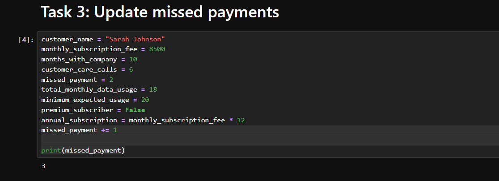
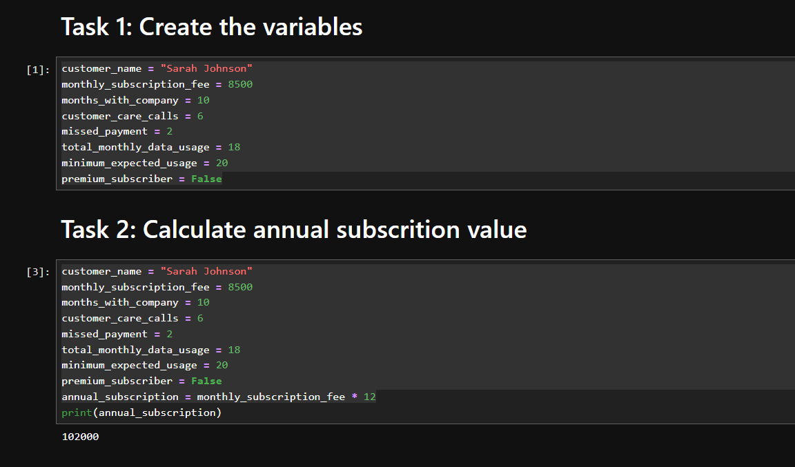
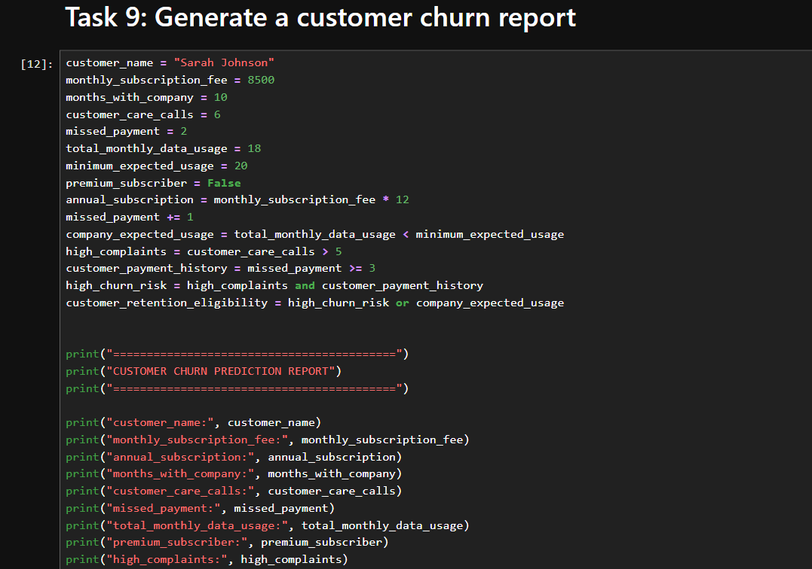
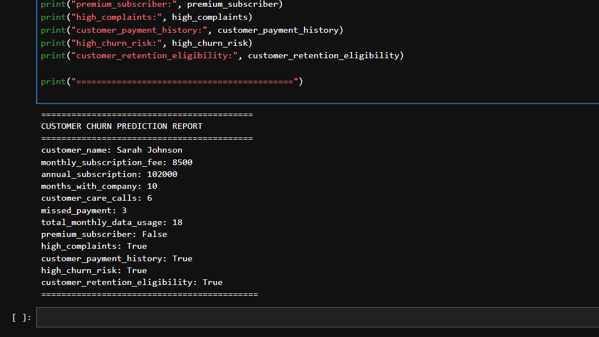

# Customer Churn Prediction System

A Python project that analyzes customer behavior and identifies customers who may be at risk of leaving a telecommunications company using core Python concepts.

## Project Overview

I built this project as part of my Python learning journey to strengthen my understanding of Python fundamentals by applying them to a practical business scenario.

The project simulates a customer churn prediction system for a fictional telecommunications company. Using customer information such as subscription details, payment history, customer support interactions, and monthly data usage, the program identifies customers who may be at risk of leaving and those who may benefit from a retention offer.

Although this project does not use machine learning, it demonstrates how Python fundamentals can be applied to solve real-world business problems.


## Business Scenario

Imagine working as a Junior Python Developer at ConnectPlus Telecom.

The company has noticed an increase in customer churn and wants a simple way to identify customers who may be planning to leave. My task was to build a Python application that analyzes customer information and provides useful insights to support customer retention.


## Project Objectives

This project performs the following tasks:

- Calculate a customer's annual subscription value
- Update missed payment records using assignment operators
- Compare monthly data usage with the expected usage level
- Identify customers with frequent support calls
- Evaluate customer payment history
- Predict churn risk
- Determine whether a customer qualifies for a retention offer
- Generate a customer churn report


## Dataset

The project uses sample data for two telecom customers.

The customer information includes:

- Customer Name
- Monthly Subscription Fee
- Months with Company
- Customer Care Calls
- Missed Payments
- Monthly Data Usage (GB)
- Minimum Expected Data Usage (GB)
- Premium Subscriber Status

## Tools Used

- Python
- Jupyter Notebook

## Python Concepts Used

While building this project, I practiced:

- Variables
- Data Types
- Arithmetic Operators
- Assignment Operators (`+=`)
- Comparison Operators
- Logical Operators (`and`, `or`)
- Boolean Expressions
- Print Statements

## Project Screenshot










## Key Features

- Calculates annual subscription value
- Updates missed payment records
- Checks customer data usage against the expected threshold
- Identifies customers with frequent support requests
- Evaluates payment history
- Predicts churn risk
- Recommends customers for retention offers
- Generates a clear customer churn report


## Calculations Performed

### 1. Annual Subscription Value
```
Annual Subscription = Monthly Subscription Fee × 12
```

### 2. Missed Payment Update

Uses the assignment operator  ```(+=)``` to update missed payment records.

### 3. Data Usage Analysis

Checks whether a customer's monthly data usage is below the company's expected minimum.

### 4. Customer Support Analysis

Identifies customers who have contacted customer support more than five times.

### 5. Payment History Assessment

Evaluates whether a customer has a poor payment history based on the number of missed payments.

### 6. Churn Risk Prediction

Uses logical operators to determine whether a customer is likely to leave the company.

### 7. Retention Offer

Checks if a customer qualifies for a retention offer based on churn risk and data usage.


## Key Findings

After running the analysis on the sample data:

### Sarah Johnson

- Identified as a high-risk customer
- Had frequent customer support calls
- Had poor payment history
- Qualified for a retention offer because her data usage was below the expected level

### David Musa

- Identified as a low-risk customer
- Maintained a healthy payment history
- Had fewer customer support interactions
- Generated a higher annual subscription value
## Learning Outcome

This project helped me understand how basic Python concepts can be combined to solve simple business problems.

While building it, I gained hands-on experience with:

- Working with variables and different data types
- Performing calculations
- Updating values using assignment operators
- Comparing values with comparison operators
- Combining conditions using logical operators
- Writing clear and readable output

More importantly, I learned that even without advanced Python libraries or machine learning, it's possible to build practical applications that provide useful business insights.

## Project Structure
```
customer-churn-prediction-system/
│
├── Customer Churn Prediction.ipynb
├── README.md
└── images/
    └── customer-churn-report.png
```
## Author
Blessing Mmesoma Ehilawa

Data Analyst


